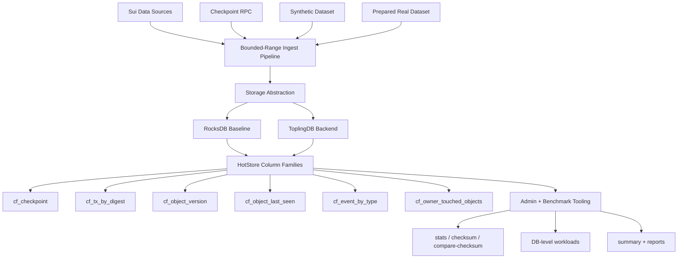

# Sui HotStore

Sui HotStore is a ToplingDB-powered local KV serving layer for Sui custom indexers, RPC hot paths, and archive-style query workloads.

[Demo Video](#demo-video) | [Benchmark Summary](#benchmark-summary) | [Known Limitations](#known-limitations) | [Run Commands](#run-commands)

## Architecture Diagram



## Run Commands

### 1. Format, check, test

```bash
cargo fmt --all
cargo check --workspace
cargo test --workspace
```

### 2. Route 1 server run

This is the current end-to-end path for bounded real-data benchmarking:

```bash
bash scripts/run-route1-benchmark-server.sh \
  --network mainnet \
  --latest-count 10000 \
  --base-dir /data4/sui-hotstore-route1-mainnet-latest-10000 \
  --backend rocksdb \
  --cargo-profile release \
  --requests 100000 \
  --concurrency 1,4,8,16,32,64 \
  --batch-size 50 \
  --tx-batch-size 50
```

To restart from scratch instead of resuming:

```bash
bash scripts/run-route1-benchmark-server.sh \
  --network mainnet \
  --latest-count 10000 \
  --base-dir /data4/sui-hotstore-route1-mainnet-latest-10000 \
  --backend rocksdb \
  --cargo-profile release \
  --reset-state
```

For a strict RocksDB vs ToplingDB comparison, prefer pinning an identical explicit checkpoint range for both runs:

```bash
bash scripts/run-route1-benchmark-server.sh \
  --network mainnet \
  --first-checkpoint 270700000 \
  --last-checkpoint 270709999 \
  --base-dir /data4/sui-hotstore-route1-mainnet-270700000-270709999-rocksdb \
  --backend rocksdb \
  --cargo-profile release
```

### 3. DB-only benchmark on an existing HotStore DB

```bash
bash scripts/run-benchmark-suite.sh \
  --backend rocksdb \
  --db-path /data4/sui-hotstore-route1-mainnet-latest-10000/db-a \
  --keys-dir /data4/sui-hotstore-route1-mainnet-latest-10000/keys \
  --report-dir /data4/sui-hotstore-route1-mainnet-latest-10000/reports \
  --requests 100000 \
  --concurrency 1,4,8,16,32,64 \
  --batch-size 50 \
  --cargo-profile release
```

### 4. Checksum and stats

```bash
cargo run --release --bin hotstore-admin -- \
  stats \
  --backend rocksdb \
  --db-path /data4/sui-hotstore-route1-mainnet-latest-10000/db-a \
  --output /data4/sui-hotstore-route1-mainnet-latest-10000/reports/stats.json

cargo run --release --bin hotstore-admin -- \
  checksum \
  --backend rocksdb \
  --db-path /data4/sui-hotstore-route1-mainnet-latest-10000/db-a \
  --output /data4/sui-hotstore-route1-mainnet-latest-10000/reports/checksum/checksum.json
```

## Benchmark Summary

Current benchmark focus:

- checksum and data equality
- DB-level workloads
- point lookup
- multi-get
- event prefix scan
- mixed RPC-style workload

Current implemented workloads:

- `get-tx`
- `get-object-version`
- `get-object-last-seen`
- `multi-get-tx`
- `multi-get-object-version`
- `scan-events`
- `mixed-rpc`

Current public summary artifact:

- [reports/summary.md](reports/summary.md)

Current benchmark-data note:

- We restored about `200G` of Sui data via the formal snapshot path.
- In practice, bringing a local `sui-node` on top of that dataset to a stable benchmark-ready state currently involves a long pruning / compaction window.
- Because of that, the current public benchmark evidence is based on a bounded route 1 workflow that pulls roughly the latest `10,000` checkpoints from live RPC into HotStore.
- Larger dataset runs are still in progress and will be added as the benchmark corpus expands.

Related benchmark materials:

- [docs/benchmark_runbook.md](docs/benchmark_runbook.md)
- [docs/sui-overflow-submission.md](docs/sui-overflow-submission.md)

## Known Limitations

- This is not a fullnode replacement.
- This is not validator storage.
- Current dataset is bounded.
- `object_last_seen` is latest observed within imported dataset.
- `owner_touched_objects` is not complete wallet inventory.
- Benchmark results are hardware-specific.

Additional current-state caveats:

- API serving is still a scaffold; the current benchmark focus is DB-level workloads.
- Real-data ingestion currently uses bounded-range Sui JSON-RPC sourcing, not full genesis replay.
- Formal snapshot and deeper Sui-native storage integration are still follow-on work.
- We already downloaded a much larger formal-snapshot dataset, but local Sui-node pruning / compaction time is still too long for that path to be the main benchmark evidence source today.

## Demo Video

- [Demo video link placeholder](#demo-video)
- Recording script: [docs/sui-overflow-demo-script.md](docs/sui-overflow-demo-script.md)

Recording status:

```text
Pending final benchmark capture from the current server runs.
```

## Related Projects

- [topling/rust-toplingdb](https://github.com/topling/rust-toplingdb)  
  RocksDB-compatible Rust binding / backend line used for ToplingDB integration and backend switching experiments in this project.

- [rockeet/sui - `use-toplingdb` branch](https://github.com/rockeet/sui/tree/use-toplingdb)  
  Sui integration branch used for ToplingDB-related experiments, configuration alignment, and comparison work alongside Sui HotStore.

## Project Scope

Sui HotStore is aimed at infra teams building on Sui:

- custom indexer operators
- RPC providers
- explorer backends
- wallet backends
- analytics and archive-query services

The current MVP is centered on:

- a bounded-range ingest path
- deterministic key encoding
- RocksDB baseline and ToplingDB backend comparison
- checksum validation
- reproducible benchmark tooling

## Repository Guide

- Core schema and records:
  - [crates/hotstore-core](crates/hotstore-core)
- Storage abstraction and backends:
  - [crates/hotstore-db](crates/hotstore-db)
- Real-data bounded-range ingest:
  - [crates/hotstore-sui-source](crates/hotstore-sui-source)
- Admin tooling:
  - [crates/hotstore-admin](crates/hotstore-admin)
- DB benchmark runner:
  - [crates/hotstore-bench](crates/hotstore-bench)
- Submission and demo materials:
  - [docs](docs)

## Roadmap

Near-term:

- finish reproducible RocksDB vs ToplingDB server benchmarks
- fill benchmark summary with current server-side results
- package Sui Overflow demo materials

Later:

- fuller API layer
- deeper Sui-native storage integration
- formal snapshot bootstrap path
- broader benchmark coverage and observability
